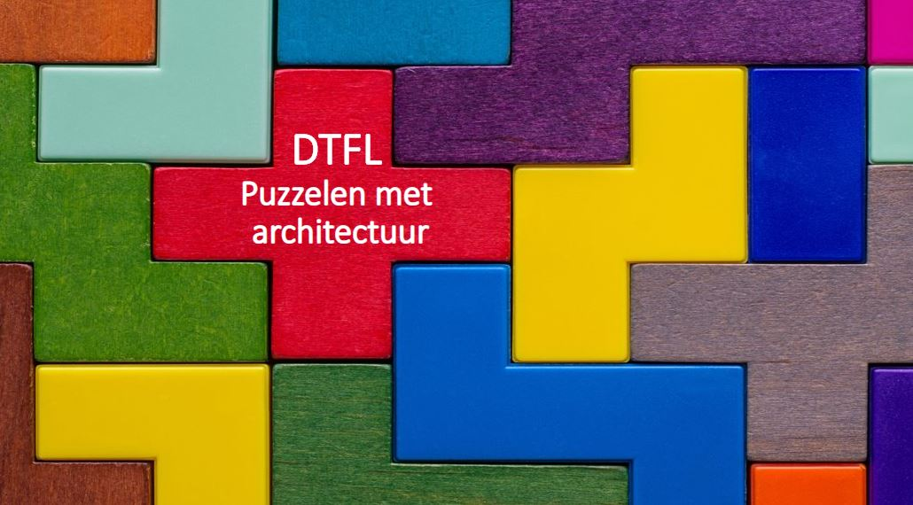

## Inleiding

*Hier de inleiding, een generieke tekst over het onderwerp van het rapport, de omgeving van eht rapport, enz ...* 

Lorem ipsum dolor sit amet, consectetuer adipiscing elit. Aenean commodo ligula eget dolor. 
Aenean massa. Cum sociis natoque penatibus et magnis dis parturient montes, nascetur ridiculus mus. Donec quam felis, 
ultricies nec, pellentesque eu, pretium quis, sem. Nulla consequat massa quis enim. Donec pede justo, fringilla vel, 
aliquet nec, vulputate eget, arcu. In enim justo, rhoncus ut, imperdiet a, venenatis vitae, justo.
Nullam dictum felis eu pede mollis pretium. Integer tincidunt. Cras dapibus. Vivamus elementum semper nisi. 
Aenean vulputate eleifend tellus. Aenean leo ligula, porttitor eu, consequat vitae, eleifend ac, enim. 
Aliquam lorem ante, dapibus in, viverra quis, feugiat a, tellus. Phasellus viverra nulla ut metus varius laoreet. 
Quisque rutrum. Aenean imperdiet. Etiam ultricies nisi vel augue. 
Curabitur ullamcorper ultricies nisi. Nam eget dui.

### Toepassingsgebied

*Beschrijf het toepassingsgebied, voorbeeld: het installatieregister, wat is het, waarvoor wordt het gebruikt (of gaat het worden gebruikt), enz ...*

Lorem ipsum dolor sit amet, consectetuer adipiscing elit. Aenean commodo ligula eget dolor. 
Aenean massa. Cum sociis natoque penatibus et magnis dis parturient montes, nascetur ridiculus mus. Donec quam felis, 
ultricies nec, pellentesque eu, pretium quis, sem. Nulla consequat massa quis enim. Donec pede justo, fringilla vel, 
aliquet nec, vulputate eget, arcu. In enim justo, rhoncus ut, imperdiet a, venenatis vitae, justo.
Nullam dictum felis eu pede mollis pretium. Integer tincidunt. Cras dapibus. Vivamus elementum semper nisi. 
Aenean vulputate eleifend tellus. Aenean leo ligula, porttitor eu, consequat vitae, eleifend ac, enim. 
Aliquam lorem ante, dapibus in, viverra quis, feugiat a, tellus. Phasellus viverra nulla ut metus varius laoreet. 
Quisque rutrum. Aenean imperdiet. Etiam ultricies nisi vel augue. 
Curabitur ullamcorper ultricies nisi. Nam eget dui.

### Doelgroep

*Beschrijf de doelgroep, wie dat zijn, en hoe ze het rapport kunnen gebruiken*

Lorem ipsum dolor sit amet, consectetuer adipiscing elit. Aenean commodo ligula eget dolor. 
Aenean massa. Cum sociis natoque penatibi et magnis dis parturient montes, nascetur ridiculus mus. Donec quam felis, 
ultricies nec, pellentesque eu, pretium quis, sem. Nulla consequat massa quis enim. Donec pede justo, fringilla vel, 
aliquet nec, vulputate eget, arcu. In enim justo, rhoncus ut, imperdiet a, venenatis vitae, justo.
Nullam dictum felis eu pede mollis pretium. Integer tincidunt. Cras dapibus. Vivamus elementum semper nisi. 
Aenean vulputate eleifend tellus. Aenean leo ligula, porttitor eu, consequat vitae, eleifend ac, enim. 
Aliquam lorem ante, dapibus in, viverra quis, feugiat a, tellus. Phasellus viverra nulla ut metus varius laoreet. 
Quisque rutrum. Aenean imperdiet. Etiam ultricies nisi vel augue. 
Curabitur ullamcorper ultricies nisi. Nam eget dui.

### Leeswijzer

*Beschrijf hoe het document gelzezen moet worden, welke hoofdstukken voor wie bedoeld zijn, enz...*

Lorem ipsum dolor sit amet, consectetuer [Analyse](#analyse) elit. Aenean commodo ligula eget dolor. 
Aenean massa. Cum sociis natoque penatibus et magnis dis parturient montes, nascetur ridiculus mus. Donec quam felis, 
ultricies nec, pellentesque eu, pretium quis, sem. Nulla consequat [Inhoudelijke Keuzes](#inhoudelijke-keuzes) massa quis enim. Donec pede justo, fringilla vel, 
aliquet nec, vulputate eget, arcu. In enim justo, rhoncus ut, imperdiet a, venenatis vitae, justo.
Nullam dictum felis eu pede mollis [Conclusies en Aanbevelingen](#conclusies-en-aanbevelingen) pretium. Integer tincidunt. Cras dapibus. Vivamus elementum semper nisi. 
Aenean vulputate eleifend tellus. Aenean leo ligula, porttitor eu, consequat vitae, eleifend ac, enim. 
Aliquam lorem ante, dapibus in, viverra quis, feugiat a, tellus. Phasellus [Expert Sessies](#expert-sessies) viverra nulla ut metus varius laoreet. 
Quisque rutrum. [Informatiemodel](#informatiemodel) Aenean imperdiet. Etiam ultricies nisi vel augue. 
Curabitur ullamcorper ultricies nisi. Nam eget dui.

### Het proces

*Beschrijf het proces waarmee dit document is ontwikkeld*

Lorem ipsum dolor sit amet, consectetuer adipiscing elit. Aenean commodo ligula eget dolor. 
Aenean massa. Cum sociis natoque penatibus et magnis dis parturient montes, nascetur ridiculus mus. Donec quam felis, 
ultricies nec, pellentesque eu, pretium quis, sem. Nulla consequat massa quis enim. Donec pede justo, fringilla vel, 
aliquet nec, vulputate eget, arcu. In enim justo, rhoncus ut, imperdiet a, venenatis vitae, justo.
Nullam dictum felis eu pede mollis pretium. Integer tincidunt. Cras dapibus. Vivamus elementum semper nisi. 
Aenean vulputate eleifend tellus. Aenean leo ligula, porttitor eu, consequat vitae, eleifend ac, enim. 
Aliquam lorem ante, dapibus in, viverra quis, feugiat a, tellus. Phasellus viverra nulla ut metus varius laoreet. 
Quisque rutrum. Aenean imperdiet. Etiam ultricies nisi vel augue. 
Curabitur ullamcorper ultricies nisi. Nam eget dui.

<figure id="voorbeeld plaatje">
    
    <figcaption>Dit is een voobeeld van een plaatje</figcaption>
</figure>

### Architectuur producten
Het team architectuur ontwikkeld de volgende architectuur producten:
* NL-DFTL Referentie architectuur bestaande uit:
    * Capabilities/ bouwblokken
    * ontwerp principes
    * constructie principes
* NL-DFTL doelarchitectuur waarin de generieke "bouwblokken/solutions" zijn opgenomen die landelijk hergebruikt kunnen (moeten) worden
* NL-DFTL roadmap met daarin de geplande realisatie van de generieke herbruikbare "bouwblokken/solution"

NL-DFTL referentiearchitectuur is het kader, de ontwerp- & constructie principes en richtlijnen, waaraan elke pilot, innovatie, projecten binnen het digital twin ecosysteem moet houden zodat de visie, publieke waarden & doelstellingen van het ecosysteem gerealiseerd worden, het ecosysteem goed blijft functioneren en toekomstig bestendig blijft. De NL-DFTL referentie architectuur is gebaseerd op wetgeving, landelijk beleid, referentie architecturen, etc.

De (nationale) ontwerp- & constructie principes geven richting aan de pilots, innovaties, projecten zodat de landelijke doelstellingen & publieke waarden behaald worden. De constructieprincipes worden in de pilots opgenomen in de Project Start Architecturen en toegepast in de solutions van de pilot. Het is niet een eenmalig proces, er vindt regulier afstemming plaats over het toepassen van de constructieprincipes in de PSA’s. 
De feedbackloop is de afstemming tussen het team architectuur en de medewerkers van de pilots over het toepassen van de constructieprincipes en het gesprek indien men noodzakelijk tijdelijk moeten afwijken. Ook kan het zijn dat een pilot leidt tot een nieuw constructieprincipe die toegevoegd wordt aan de referentie architectuur. Het is ook mogelijk dat de pilots aanvullende domein specifieke constructieprincipes & open standaarden moeten hanteren specifiek voor een domein of thema.

De generieke (herbruikbare) bouwblokken/ capabilities zijn de verzameling van functionaliteiten die nodig zijn in het digital twin ecosysteem om de werking van de toepassingen te ondersteunen die de publieke waarden realiseren.

De NL-DFTL doelarchitectuur is het vergezicht met de generieke (herbruikbare) bouwblokken/ solutions die nodig in het digital twin ecosysteem om de werking van de toepassingen te ondersteunen die de publieke waarden realiseren.

Voorbeelden van de generieke (herbruikbare) bouwblokken solutions in het digital twin ecosysteem zijn:
* Toepassingen, bijvoorbeeld een geluidsimulatie model; crowd-monitor; landelijke fijnstof voorspelmodel
* Software componenten, bijvoorbeeld: 3D viewer, identificatie component, API management & gateway, data opslag, etc.
* Infrastructuur componenten, bijvoorbeeld fysieke connectiviteit en dataverbindingen

De generieke bouwblokken/solutions in het digital twin ecosysteem worden zo veel mogelijk hergebruikt  in nieuwe toepassingen die publieke waarden realiseren. 

Met de NL-DFTL doelarchitectuur is het mogelijk om de strategische dialoog te kunnen voeren welke extra investeringen in de landelijke ICT-voorzieningen nodig zijn voor de nationale doelstellingen en publieke waarden te realiseren en met welke prioriteit. Dit resulteert in aanvullende ontwikkeling op de NL-DFTL roadmap. 

De pilots ontwikkelen de bouwblokken solutions die opgenomen zijn (worden) in de roadmap van de NL-DFTL doelarchitectuur. 
De pilot hebben eigen business wensen en publieke waarden die gerealiseerd worden, maar dragen met generieke bouwblokken solutions die hergebruikt kunnen worden, bij aan de realisatie van de NL-DFTL doelarchitectuur en daarmee de nationale doelstellingen en publieke waarden. 

De bouwblokken/ solutions op de roadmap is de basis voor de NL-DFTL doelarchitectuur met de prioriteiten pilots. Hiermee wordt het goed in samenhang functioneren en optimaal hergebruik van de ICT middelen bereikt en daarme voor optimaal rendement van de landelijke investeringen.

In onderstaand figuur zijn de architectuurproducten weergegeven met een rode stip die in het programma gerealiseerd worden:
<figure id="Architectuur producten">
    
    <figcaption>Dit is een voobeeld van een plaatje</figcaption>
</figure>