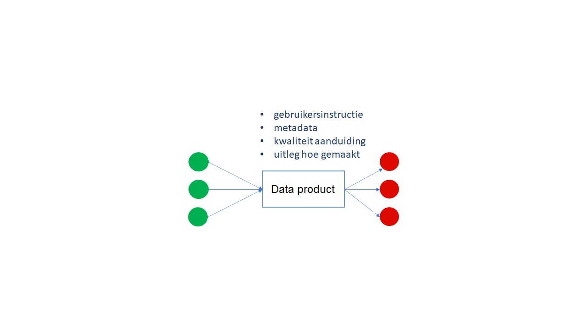

## Ontwerp Principes

### Inleiding

In dit hoofdstuk wordt de constructie, de architectuur en en de ontwerpprincipes beschreven. Ook wordt de link gelegd met de principes uit NORA, DisGeo en Common Ground.

### Principes

*Tabel hieronder is Illustratief*

| Principe | Beschrijving | Referentie                                            |
|----------|--------------|-------------------------------------------------------|
| DTFL01   |              | NORA [BP01](https://www.noraonline.nl/wiki/Proactief) |
| DTFL02   |              | NORA [BP02](https://www.noraonline.nl/wiki/Vindbaar)  |

<aside class='note'>
    JvG: Hoofdstuk over "by design", zoals security by design. TZ: en onderstaande principes telkens ook meeformuleren in andere functionele blokken
</aside> 

•	Overzicht en verantwoording herkomst, door datahouder toegestane gebruikscondities, en gebruiksnut gebruikte datasets 
(Ton, obv EU digital rights/principles)  
•	Aansluiting op dataspaces tbv het ophalen van data (Ton, obv EU dataspaces)  
•	Aansluiting op dataspaces tbv het herbruikbaar delen van uitkomsten, (Ton, obv EU dataspaces)  
•	Bij delen van uitkomsten naar een dataspace het meegeven van eventuele gestelde condities/voorwaarden voor hergebruik, en 'geërfde' voorwaarden obv gebruikte ingangsdata zoals share-alike voorwaarden (Ton, obv dataspaces)  
•	Aansluiting op dataspaces tbv het in de DT gebruiken v data terwijl die data niet verkregen/gedeeld kan/mag worden 
(Ton, obv EU dataspace / Data governance Act) (denk aan het trainen van een model / simulatie in de DT met CBS microdata, 
terwijl de microdata zelf niet in de DT zit: dit is het soort gebruik dat de DGA mogelijk maakt terwijl de data niet gedeeld wordt, en vergt dus een 'live' manier om buiten de DT met zulke data te interacteren, zodat de resultaten wel in de DT zitten telkens.  
•	Verantwoording t.a.v. toetsbaarheid en uitlegbaarheid van gebruikte rekenmodellen / algoritmes / AI toepassingen (Ton, obv EU AI Verordening)
•	Federatie  (in- en aansluiting van / door andere DTs) (Ton, obv EU Digital Twin plannen)  
•	het tijdelijk/kortstondig gebruiken (en daarna verwijderen) van persoonlijke gegevens (bijv mobliteitsdata) voor een specifieke 
gerichte context/vraag (Ton, obv personal dataspaces, data-altruisme, AVG)  
•	het alleen voor een specifieke vraag in de DT gebruiken van een dataset, en verantwoording daarvan (Ton, obv EU data altruisme) 
(data altruisme is persoonsgebonden of bedrijfsvertrouwelijke data die van een daartoe erkende tussenpersoon komt en voor een specifiek publiek belang kan worden ingezet, onder tevoren bepaalde gebruikscondities  
•	databronnen kunnen verwijderen (en aantoonbaar, e.g. door logs) (Ton, obv EU AVG, digital principles, data minimalisatie)  

In hoofdstuk XXX [Inleiding] staat een schets van het digitale tweeling stelsel. Dit is opgebouwd op basis van een combinatie van federatieve opslag van gegevens, modellen en bewerkingsfunctionaliteit, aangevuld met een aantal essentiële centrale, federatieve componenten, waardoor gegevens, modellen en bewerkingsfunctionaliteit over en weer gebruikt kunnen worden. In het vorige hoofdstuk staan algemene uitgangspunten of principes waaraan het stelsel moet voldoen. In dit hoofdstuk gaan we weer een laagje dieper. We gaan kijken naar de wijze waarop digitale tweeling mogelijk wordt voor deelnemende organisaties. Dit verwoorden we in ontwerp principes. De ontwerp principes worden toegepast in meerdere typen ontwerpdocumenten, zoals projectstartarchitecturen, solution architecturen, datacommunicatie architecturen, infrastructuur architecturen, etc. Digitale tweeling kent immers veel componenten, die met elkaar het stelsel vormen. Elk van de hierbinnen toegepaste componenten, worden bij voorkeur in lijn met de ontwerp principes uit dit hoofdstuk ontworpen en gerealiseerd, waardoor zij inpasbaar zijn in het totale stelsel. Toepassing van ontwerpprincipes kan dus ook gezien worden als het zorgen voor een hoge mate van interoperabiliteit binnen het stelsel. 

### De sociale dimensie van de Digitale Tweeling voor de Fysieke Leefomgeving

Het concept van Digitale Tweeling wordt beschreven als de virtuale representatie (of de digitale tegenhanger) van een fysiek object of process. Wanneer we echter de Digitale Tweeling van de Fysieke Leefomgeving (met de nadruk op **Leef**opgeving) met de mens als deel van de tweeling is het belangrijk ook het **sociale** element mee te nemen in de Referentie Architectuur. De mens speelt immers een belangrijke rol in de use-cases: de leefomgeven is er voor en door de mens (en dier en bij uitbreiding het leefmilieu).

De leefomgeving verschuift (met de inbreng van een Digitale Tweeling) van een sociaal-fysieke samenleving, waarin digitalisering beschouwd wordt als een ‘parallelle werkelijkheid’ en/of dat het een instrument is dat naar believen kan worden ingezet, naar een sociaal-fysiek-digitale samenleving. Hierin is digitaal onlosmakelijk verbonden met alle aspecten van ons sociaal-fysieke leven. De digitale tweeling krijgt naast de fysiek-digitale dimensie er een sociaal-digitale en sociaal-fysieke dimensie bij (het wordt als het ware een Digitale **Drieling**)

De inbreng van het sociaal aspect heeft zo ook een impact op de ontwerpPrincipes: de digitale identiteit (wat we mogen zien/doen, gebaseerd op onze digitale identiteit), regels voor het beschermen van onze privacy, ethiek en duurzaamheid, middelen om te communiceren naar de burger (en omgekeerd). Deze mogen elementen moeten van de start meegenomen worden in de referentie architectuur en mogen geen nakomertje/bijzaak zijn die er achteraf bijgenomen wordt.

### De constructie
Hoe ziet de constructie eruit waar heel veel verschillende stakeholders met elkaar werken vanuit verschillende domeinen en waar de infrastructuur dient te faciliteren om met behulp van data gedreven werken allerlei maatschappelijke opgaven integraal te ondersteunen? Hoe zetten we de kracht van data, analyse en visualisatie optimaal en verbindend in? In deze paragraaf geven we hier een antwoord op. 

Op allerlei plaatsen zijn er initiatieven rond digitale tweelingen, waarin naast meer statische data ook nadrukkelijk gebruik gemaakt wordt van rekenmodellen, dynamische data en visualisatie-services. Digitale tweelingen richten zich niet alleen op de vastlegging van de fysieke leefomgeving, maar met name op processen in die fysieke leefomgeving: denk bijvoorbeeld aan verkeersstromen, stikstofdistributie, geluidsbelasting of de drukte in de stad. Daarvoor is niet alleen statische data over de fysieke leefomgeving zelf nodig, maar juist ook dynamische data (waarnemingen uit sensoren) over hoe die processen zich afspelen in tijd, ruimte en in combinatie met sociale aspecten.  

De architectuur van de Nationale digitale tweeling infrastructuur kenmerkt zich door een enorme hoeveelheid stakeholders die werken in verschillende domeinen. Er is niet een digitale tweeling maar een zeer grote diversiteit aan digital tweelingen in de verschillende domeinen voor zeer veel toepassingen in Nederland (en daarbuiten). De digitale tweelingen zijn verbonden met elkaar daar waar nuttig. De verbonden digitale tweelingen noemen we het digitale tweeling eco-systeem of digitale tweeling stelsel. De architectuur van Nationale digitale tweeling infrastructuur die we ontwerpen is geen ontwerp van één digitale tweeling maar van een stelsel aan digitale tweelingen. 

Het stelsel kan niet gerealiseerd worden door barrières op te werken waarbij het tempo van de stakeholders wordt bepaald door de randvoorwaarden van de architectuur. De architectuur moet faciliteren dat de stakeholders duizend bloemen kunnen laten bloeien. Dit vraagt gedecentraliseerde oplossingen als basis voor democratisering van iedere stakeholder. Alleen in een federatieve2 architectuur met federatieve governance kan de complexiteit van Nationale digitale tweeling infrastructuur worden gerealiseerd.  

In onderstaand figuur is een globale schets van de architectuur van de Nationale digitale tweeling infrastructuur weergegeven. 

<figure id="Overall architectuur">
    
    <figcaption>figuur x. Overall architectuur</figcaption>
</figure>

De architectuur bestaat uit generieke componenten die FAIR3 ondersteunen, de vindbaarheid, toegankelijkheid, interoperabiliteit en herbruikbaarheid. 

Om er voor te zorgen dat de Nationale digitale tweeling infrastructuur voldoet aan de FAIR richtlijnen introduceren we een nieuw concept “data mesh” waarmee we tevens ook de complexiteit ordenen. 

Het concept data mesh heeft een architectuur die gebaseerd is op federatieve oplossingen waar de data en het ondersteunen van opschalen centraal staat. Deze architectuur is gebaseerd op grote complexe domeinen, organisaties en stakeholders.  

Voor de architectuur van de Nationale digitale tweeling infrastructuur voegen we een aantal onderdelen toe aan het data mesh concept of vullen we het iets anders in maar in essentie hanteren we de data mesh architectuur als basis.  

De data mesh architectuur gaat uit van een viertal primaire uitgangspunten, dit zijn: 

1. Domein eigenaarschap 

De infrastructuur ondersteunt een federatieve aanpak met een verdeling van verantwoordelijkheid naar mensen die het dichtst bij de gegevens staan. We hebben al zoveel werkende domeinen met een eigen dynamiek en governance die we nog beter en in samenhang waar relevant willen laten werken. 

2. Data als een product 

Met data als een product stellen we het dataproduct centraal. Het dataproduct is een ‘atomaire’ eenheid en heeft de metadata, ontstaansgeschiedenis, kwaliteit, e.d. allemaal bij het product zelf staan en heeft mechanismen om afnemers te informeren en consulteren. 

<figure id="dataproduct">
    
    <figcaption>figuur x. dataproduct</figcaption>
</figure>

3. Self-service data infrastructuur 

Ook een federatieve structuur heeft basisvoorzieningen nodig om dataproducten, modellen, e.d. te kunnen vinden. De inrichtingswijze wordt wel een andere omdat de metadata bij de data staat. Basisvoorzieningen voor mensen en machines maken gebruik van federatieve indexen en dit kan niet zonder afsprakenstelsels. 

4. Federatieve governance 

Afsprakenstelsels zijn nodig om het geheel te kunnen laten werken. Dit betreft niet alleen standaarden voor het delen van data, data-producten, modellen maar ook ethiek, privacy, transparantie, e.d. Governance vraagstukken liggen op de gedeelde voorzieningen, in een federatief stelsel zijn de overige governance vraagstukken voor de domeinen.  

Met het datamesh concept passen we een mesh topologie5 toe. Dit is een vermaast netwerk waarin de dataproducten de nodes zijn van waaruit de data wordt doorgestuurd naar gebruikers, afnemende applicaties of andere dataproducten. 

<figure id="datamesh">
    
    <figcaption>figuur x. datamesh</figcaption>
</figure>

Om onderdeel te kunnen zijn van de Nationale Digitale Tweeling infrastructuur dienen de volgende constructie principes gevolgd te worden. 

#### Domein eigenaarschap

Data mesh is in de kern gebaseerd op decentralisatie en verdeling van verantwoordelijkheid naar mensen die het dichtst bij de gegevens staan ​​om continue verandering en schaalbaarheid te ondersteunen. Een domein6 heeft de verantwoordelijkheid voor data-producten. Degene die de verantwoordelijkheid over de data-producten hebben moeten in dialoog kunnen zijn met de afnemers. Dit lukt niet als de data vele malen wordt gekopieerd en binnen allerlei systemen een eigen context krijgen.  

1.2.1	Duidelijk eigenaarschap data 

De dataproducten hebben een eigenaar en deze is hierop aanspreekbaar. Een dataproduct zonder duidelijk eigenaarschap is geen onderdeel van de nDTFL. 

1.2.2	We gebruiken data vanuit de bron 

Om een dataproduct te maken gebruiken we de data uit de bron waarbij op basis van services. Alleen de bron heeft de juiste, meest actuele versie van de data en bevat alle context. De eigenaar van de data wijst afnemers de juiste ​weg en faciliteert ze, waar nodig, bij het benaderen van de bron. 

1.2.3 	De brondata past op de afnemersbehoeften  

De eigenaar van dataproduct heeft de zorgplicht dat de output data continu geleverd wordt conform de afspraken (SLO) zodat deze door andere dataproducten gebruikt kan worden. Dit vraagt een continue dialoog tussen de data product-eigenaar en afnemers cq. afnemende dataproducten.

<aside class=note>
    
GT: Moet dit daadwerkelijk SLO zijn, of wordt hier SLA bedoeld?

</aside>

<figure id="dataproduct eigenaar">
    
    <figcaption>figuur x. dataproduct eigenaar</figcaption>
</figure>

Domeinen kunnen op verschillende manieren georganiseerd zijn. Dit is vrij en naar behoefte van het werkveld. Denk bv. aan verticale kennisdomeinen zoals luchtverontreiniging of horizontale domeinen als sensoren. De DTFL schrijft de inrichting niet voor dit is een sociaal maatschappelijk proces dat continue in beweging zal zijn en alleen kan bestaan als dit waarde toevoegt voor de betrokken stakeholders en daarmee verbonden is met lange termijn eigenaarschap vanuit het domein. In de praktijk bestaan de meeste domeinen al. In de DTFL brengen we deze in beeld. 

1.2.4 	We schrijven geen domeinen voor 

De inrichting van de domeinen is een sociaal maatschappelijk proces gebaseerd op de behoeften van stakeholders. 

In de domeinen bestaat enorm veel data. Hoe houden we dit bij elkaar in een wereld van decentralisatie en domeinen die hun eigen context(en) van de gegevens nodig hebben? De data mesh hanteert hiervoor de volgende aanpak: 

Objecten hanteren een globaal uniek extern gericht identifier systeem 

De mogelijkheid om modelmatig dezelfde data (begrippenkader) aan elkaar te verbinden 

De mogelijkheid om data aan elkaar te verbinden 

1.2.5	Verbinden in plaats van verzamelen 

Tussen of binnen een domein wordt brondata niet met elkaar verbonden in een datawarehouse, datalake of andere omgeving. De data wordt op bovenstaande wijze (1. t/m 3.) verbonden zodat een verbonden stelsel van data ontstaat gericht op herbruikbaarheid (in plaats van specifieke oplossingen).  

Data Mesh onderkent Domain driven design (DDD) als een manier om domeinen te modelleren. Business-vertegenwoordigers en software-ontwikkelaars spreken dezelfde eenduidige taal (‘ubiquitous language’) die de kernbegrippen binnen het domein bevat. DDD onderkent het feit dat standaardisatie van modellen en taal slechts tot op zeker hoogte mogelijk én wenselijk is binnen een divers systeem, zeker wanneer daarbij meerdere organisaties betrokken zijn.  

Domeinen gebruiken, vanwege het taak-specifieke karakter vaak om goede redenen, verschillende begrippen in een andere betekenis of dezelfde begrippen met een verschillende betekenis. Zo kan een ‘klant’ in het ene domein vergelijkbaar zijn met wat in een ander domein ‘cliënt’ wordt genoemd. Andersom kan het begrip ‘klant’ in meerdere domeinen worden gebruikt maar een, ietwat of sterk, verschillend betekenis hebben. DDD hecht daarom veel belang aan het zorgvuldig afbakenen van wat wel en niet tot een domein behoort (‘bounded context’) en benadrukt dat begrippen een domein gebonden betekenis hebben. 

1.2.6 	Er bestaan meerdere contexten van de werkelijkheid 

De data heeft binnen het domein waarin ze zijn ontstaan een specifieke betekenis. 

Binnen de DTFL hebben we een bijzonder domein. Dit is het domein van de basisregistraties. Basisregistraties zijn context onafhankelijk en zijn het fundament onder de data uit de domeinen. Zonder fundament hanteren de domeinen verschillende referenties en kunnen we de resultaten niet meer met elkaar vergelijken. Denk aan het gebruik van topografie die op een andere plek ligt dan de Basisregistratie Grootschalige Topografie (BGT).  

1.2.7	De domeinen hanteren de basisregistraties en relaties tussen de basisregistraties als fundament 

De (basis)registraties bestaan uit de Basisregistratie Grootschalige Topografie (BGT), Basisregistratie Topografie (BRT), Basisregistratie Adressen en Gebouwen (BAG), Basisregistratie Ondergrond (BRO), Basisregistratie Kadaster (BRK)?, Landelijke Voorziening Beeldmateriaal?, 3D Basisvoorziening? 

Het onderscheid dat we van oudsher hebben tussen operationele (veelal transactie-gebaseerde) en analytische data zal steeds meer vervallen. Analytische data maakt direct gebruik van de operationele data en levert vaak ook weer feedback op de operationele data. Analytische data kan weer operationele data zijn voor een ander DTFL proces. We brengen data naar de modellen en modellen naar de data. Dit organisch stromen van data faciliteren we door de domein-structuur. We hanteren hier het concept van data als een product, zie volgende paragraaf. 

#### Data als een product
Data als een product lijkt vanzelfsprekend omdat we dit naar ons gevoel al doen. Echter in de huidige infrastructuren beschouwen we data en techniek als 2 aparte dingen terwijl bij data als een product dit een is. Data als een product heeft daarnaast nog een subtiel maar essentieel verschil. Nu leveren we data, denk aan grote bestanden waar de gegevensgebruiker, gegevensanalist, etc. zelf zijn relevante gegevens maar moet uithalen en vaak zelf moet omzetten naar werkbare formaten. Met data als een product voegen we product denken (product thinking) toe. De gebruikers moeten als klant worden behandeld en wel op zo’n manier dat de klant gelukkig wordt van de wijze waarop de data geconsumeerd kan worden. Succesvolle producten8 zijn waardevol, eenvoudig bruikbaar en haalbaar om te maken. Het concept van succesvolle producten is ook toegepast op data als een product.  

De data als een product is een atomaire eenheid. Het is niet zo dat op andere plekken ‘metadata’ wordt opgeslagen van het dataproduct maar bij data mesh is al deze informatie aanwezig bij het dataproduct zelf. Dit past bij de federatieve aanpak. 

Een dataproduct kan bestaan uit: 
* Transactie data – data in transactionele werkprocessen zoals bijvoorbeeld financiële transacties, maar ook sensor data of events 
* Analytische data – dit is transactionele data dat gecombineerd, bewerkt, verrijkt en/of geaggregeerd is uit verschillende bronsystemen. Analytische data biedt nieuwe kennis en inzichten. 
* Combinatie van beiden 

Dataproducten bieden output data aan gebruikers of afnemende applicaties zoals bijvoorbeeld een viewer of een dashboard tool en is softwareproduct (tool) onafhankelijk.

<figure id="dataproduct">
    
    <figcaption>figuur x. dataproduct</figcaption>
</figure>

Een dataproduct bestaat uit: 

Code  
* API’s, notificaties of andere wijzen waarop je de data kunt benaderen of verkrijgen  
* Code om van de input data nieuwe output data te maken, data transformatie. Dit kan middels een pipeline transformatie zijn, API-led, maar ook een algoritme, streaming data-analyse  

Polyglot input- en output data:  
* De input én output is in verschillende open standaard dataformaten (graph’s, JSON, XML, etc.) waarbij de semantiek hetzelfde is uitgedrukt  
* De input en output is op basis van open standaard mechanisme zoals: batch; streaming data; SQL; API; geo-webservices; Query  
* De input en output is transactionele- en/of analytische data  

Van het ontwerp principe polyglot input- en output data azijn in hoofdstuk 5 constructie principes opgenomen.

| ontwerp principe | constructie principe                          |
|------------------|-----------------------------------------------|
| polyglot input   | NTB                                           |
| polyglot output  | NTB                                           |

Dataproduct ontwikkeling:   

Op basis van de input wordt output data ontwikkeld op basis van diverse (moderne) technieken zoals pipelines voor datatransformatie, algoritmen, streaming data-analyse, etc.; Op basis van de technieken worden dataproduct ontwikkelt en beheerd.

<figure id="dataproduct ontwikkeling">
    
    <figcaption>figuur x. dataproduct ontwikkeling</figcaption>
</figure>

In hoofdstuk 5 zijn de constructie principes van dit ontwerp principe uitgewerkt.

| ontwerp principe | constructie principe                          |
|------------------|-----------------------------------------------|
| dataproduct ontwikkeling    | NTB                                           |

De dataproducten bestaan uit verschillende typen informatie. Operationele data of een model, het informatiemodel, begrippen of andere typen zoals ontstaansgeschiedenis, tijdslijnen, kwaliteit, etc. De typen variëren op basis van de aard van het dataproduct. 

<figure id="dataproducten">
    
    <figcaption>figuur x. dataproduct typen</figcaption>
</figure>

Van een of meerdere dataproducten kan ook een nieuw dataproduct gemaakt worden. Dit kan een samenstelling zijn of het resultaat van een algoritme zoals een tijdelijke analyse, voorspelmodel, e.d. Dit nieuwe product kan ook weer een dataproduct worden dat door andere stakeholders gebruikt kan worden in hun ecosysteem. De dataproducten zijn permanent verbonden (vanuit de bron). Voor dataproducten geldt dat ze moeten voldoen aan constructieprincipes van het ecosysteem. 

<figure id="dataproduct samenstelling">
    
    <figcaption>figuur x. dataproduct samenstelling</figcaption>
</figure>

Een dataproduct wordt ontwikkeld in een domein en heeft één product eigenaar. Een domein heeft een of meerdere dataproducten en eigenaren.

<figure id="dataproduct eigenaar">
    
    <figcaption>figuur x. dataproduct eigenaar</figcaption>
</figure>

In hoofdstuk 5 zijn de constructie principes van dit ontwerp principe uitgewerkt.

| ontwerp principe | constructie principe                          |
|------------------|-----------------------------------------------|
| dataproduct eigenaar    | NTB                                           |

Informatie vraagstukken kunnen betrekkingen hebben om meerdere dataproducten van verschillende domeinen (afdelingen, organisatieonderdelen cq. organisaties). Ter illustratie een voorbeeld voor verkeersregel installaties. Hierin worden dataproducten in een keten gebruikt waarin een dataproduct een algoritme als transformatie technologie inzet.    

<figure id="dataproducten keten">
    
    <figcaption>figuur x. dataproducten keten</figcaption>
</figure>

Dit kunnen we ook toepassen op een overkoepelend vraagstuk waarbij verschillende dataproducten zijn gebruikt. Bijvoorbeeld het vraagstuk of Nederland voldoende beschermd is tegen het water in geval van enorme regenval en smeltwater in de grote rivieren zoals de Maas en de Rijn. De dataproducten worden dan gebruikt in het domein water risico’s.

<figure id="domein">
    
    <figcaption>figuur x. domein water risico's</figcaption>
</figure>

Dataproducten hebben kenmerken of te wel constructie principes die toegepast moeten worden in de ontwikkeling van het dataproduct om te kunnen (mogen) aansluiten op het landelijke digitale tweeling eco-systeem nDFTL. 

<figure id="ontwerp principes dataproduct">
    
    <figcaption>figuur x. ontwerp principes dataproduct</figcaption>
</figure>

Ontwerpprincipes dataproduct: 

1.3.1	Vindbaar 

Vindbaarheidsinformatie wordt verstrekt door het dataproduct zelf.  

Vindbaarheid van dataproducten binnen het DTFL-stelsel gebeurt aan de bron. Het is aan de individuele dataproducten om hun vindbaarheidsinformatie op een standaard manier te delen. Elk dataproduct deelt continue zijn oorsprong, eigenaren, runtime-informatie zoals tijdigheid, kwaliteitsstatistieken, voorbeeldgegevenssets en vooral informatie die is bijgedragen door hun consumenten, zoals de belangrijkste gebruiksscenario's en toepassingen die door hun gegevens mogelijk worden gemaakt.  

Via een centrale mogelijkheid worden deze federatieve indexen bevraagt voor een totaaloverzicht. 

| ontwerp principe | constructie principe                          |
|------------------|-----------------------------------------------|
| vindbaar         | NTB                                           |

1.3.2	Begrijpelijk 

Het dataproduct is zelfbeschrijvend. 

Uit welke begrippen, definities, relaties, waardelijsten, e.d. – de semantiek - bestaat het dataproduct? Naast begrip van de semantiek, moeten datagebruikers begrijpen hoe de gegevens aan hen worden gepresenteerd. Hoe hebben ze toegang? Hoe kunnen ze de data syntactisch opvragen? Wat voor soort SQL-query's kunnen ze uitvoeren? Hoe lees je de data-objecten? Dit gaat idealiter vergezeld van voorbeelddatasets en voorbeeldcodes.  

Dataschema’s helpen om de datagebruiker te ondersteunen. Dit geldt ook voor computational notebooks10 die het verhaal van een dataproduct helpen vertellen. Computational notebooks bevatten documentatie van de data, evenals code om het te gebruiken en het visueel demonstreren van de code in actie. 

Ten slotte is begrijpbaarheid een sociaal proces. Wij leren van elkaar. Het moet eenvoudig zijn om als datagebruiker ervaringen te delen die weer zorgen voor betere ondersteuning op bruikbaarheid. 

| ontwerp principe | constructie principe                          |
|------------------|-----------------------------------------------|
| begrijpelijk      | NTB                                           |

1.3.3 	Betrouwbaar en waarheidsgetrouw 

Elk dataproduct heeft Service Level Objectives (SLO's) die een acceptabel kwaliteitsniveau garanderen en worden nageleefd door de dataproduct eigenaar.  

Een SLO omvat onder meer: 
* Interval van verandering 
* Actualiteit 
* Volledigheid 
* Statistische vorm van gegevens 
* Ontstaansgeschiedenis – de datareis 
* Precisie en nauwkeurigheid in de loop van de tijd 

Operationele kwaliteiten 

Hoe beter de data-eigenaar deze gegevens bij zijn dataproduct vastlegt, bijhoudt en beheert, hoe meer vertrouwen de datagebruikers zullen hebben in het dataproduct zelf. 

| ontwerp principe | constructie principe                          |
|------------------|-----------------------------------------------|
| betrouwbaar      | NTB                                           |

1.3.4 	Adresseerbaar 

Een dataproduct moet een vast en uniek adres hebben voor de datagebruiker om het handmatig of vanuit software te kunnen openen. 

Een uniek adresseringssysteem moet de dynamische aard van de data en de mesh-topologie ondersteunen. Het moet aspecten omvatten van dataproducten die continu kunnen veranderen en tegelijkertijd de continuïteit van het gebruik ondersteunen. Het adresseringssysteem moet de volgende continu veranderende aspecten van de dataproducten accommoderen: 
* Voortdurende verandering in de semantiek van het dataproduct, versies 
* Continue release van nieuwe data-time slices (gekoppeld aan een bepaalde tijds(duur) 
* Nieuwe ondersteunde syntaxis van de onderliggende data: nieuwe manieren van serialiseren, het verzenden en opvragen van de gegevens 

Continu veranderende runtime gedragsinformatie: b.v. SLO's (als code) 

Een uniek adresseringssysteem moet een wereldwijde conventie volgen zodat de data-producten een consistente toegang hebben voor mensen en machines. Dit is ook nodig om gevonden te kunnen worden door de discover-oplossing (1.2.1 Vindbaar). 

| ontwerp principe | constructie principe                          |
|------------------|-----------------------------------------------|
| adresseerbaar    | NTB                                           |

1.3.5	Semantische interoperabiliteit 

De dataproducten moeten zoveel als mogelijk met elkaar inhoudelijk combineerbaar kunnen worden. 

Een van de belangrijkste zorgen in een gedistribueerde data-architectuur is de mogelijkheid om data te correleren/in samenhang over domeinen heen te gebruiken. 

De sleutel voor semantische interoperabiliteit van data tussen domeinen is het volgen van standaarden en harmonisatieregels, die het mogelijk maken om gegevens over domeinen heen zinvol in samenhang te bevragen. Hiervoor zullen we een aantal zaken moeten standaardiseren die de interoperabiliteit van de dataproducten vergemakkelijken: 

Volgen van Metamodel informatiemodellering (MIM) voor informatiemodellen11, 12 
* Gestandaardiseerde metadata 
* Geharmoniseerde begrippen en definities 
* (knowledge) graphs 
* Mogelijkheid tot hergebruik en koppeling aan begrippen, informatiemodellen, graphs, etc. 
* naar schema's - typen - gedefinieerd door andere dataproducten. 

| ontwerp principe | constructie principe                          |
|------------------|-----------------------------------------------|
| semantische interoperabiliteit         | NTB                                           |

1.3.6	Toegankelijk en veilig 

Gegevensgebruikers moeten op een veilige en vertrouwelijke manier toegang krijgen tot het gegevensproduct. 

Veilige toegang is een must of de architectuur nu gecentraliseerd of gedistribueerd is. In de wereld van gedecentraliseerde architectuur zoals Data Mesh wordt de toegangscontrole tijdens runtime gevalideerd door het dataproduct. Het toegangscontrolebeleid wordt centraal gedefinieerd (design time). Denk hierbij aan: 
* Toegangscontrole 
  Wie, wat en hoe hebben systemen toegang tot het dataproduct? 
* Encryptie 
  Welke soorten versleuteling ondersteunen we? 
* Vertrouwelijkheidsniveaus 
  Welke soorten vertrouwelijke informatie, denk aan persoonsinformatie, draagt het dataproduct? 
* Dataretentie 
  Hoe lang de informatie moet worden bewaard? 
* Regelgeving en overeenkomsten 
  AVG, domeinspecifieke regelgeving, contractuele overeenkomsten 
* Doelbinding 
  Voor welke doelen mag het dataproduct worden gebruikt. 

| ontwerp principe | constructie principe                          |
|------------------|-----------------------------------------------|
| Toegankelijk en veilig         | NTB                                           |

1.3.7	Waardevol 

Het dataproduct moet inherente waarde voor de datagebruikers en klanten toevoegen (anders hoeft het niet te bestaan). Publieke waarden en business waarden. 
En ergens opnemen dat de data op verschillende technische manieren te benaderen is op ‘API’ manieren. Data en techniek zijn 1. 
Datakwaliteit toevoegen inzichtelijk volgens een generiek (landelijk) datakwaliteit framework.

| ontwerp principe | constructie principe                          |
|------------------|-----------------------------------------------|
| waardevol         | NTB                                           |

Van een dataproduct kunnen constructieprincipes afgeleid worden. Deze zijn beschreven in hoofdstuk 5. In onderstaand figuur zijn van de onderdelen in de gele kaders constructieprincipes beschreven.

<figure id="Dataproduct totaalview">
    
    <figcaption>figuur x. dataproduct totaal view</figcaption>
</figure>

#### Dataproduct infrastructuur
Elk dataproduct heeft infrastructuur waarop het product continue beschikbaar is. De infrastructuur borgt dat het dataproduct voldoet aan de afgesproken SLO. Vanuit het programma nDFTL worden géén architectuur ontwerp- en constructie principes opgelegd hierin is elke producteigenaar vrij om keuzes te maken.
We kunnen wel een advies dataproduct infrastructuur verstrekken.

In onderstaand figuur is weergegeve dat elk data product infrastructuur heeft 
<figure id="dataplatform view">
    
    <figcaption>figuur x. dataproduct infrastructuur </figcaption>
</figure>

Data producten wisselen data niet point-to-point uit maar altijd via self service platform. Er zijn veel manieren om een data mesh te implementeren en een organisatie kan meerdere manieren toestaan om toegang te krijgen tot hetzelfde dataproduct. 

Er zijn 3 architectuur patronen voor uitwisseling van data tussen dataproducten die de basis infrastructuur ondersteunt volgens polyglot constructie principes:
* Event-driven Data Mesh: dataconsumenten ontvangen automatisch een update van de data zodra er iets verandert binnen een dataproduct. Pub/Sub
* Query-Driven Data Mesh: dataconsumenten kunnen periodiek de database van het dataproduct doorzoeken met behulp van SQL of een andere querytaal. Of verkrijgen data uit meerdere bronnen gecombineerd – API query based, snapshot on demand
* File-Based Data Mesh: het dataproduct wordt geaggregeerd en ofwel in een bestand of in een cloud gebaseerd file bucket geplaatst voor dataconsument om te gebruiken. 

In onderstaand figuur zijn 3 architectuur patronen infrastructuur heeft 
<figure id="data mesh implementations">
    
    <figcaption>figuur x. data mesh infrastructuur implementatie</figcaption>
</figure>

#### Basisinfrastructuur
Om het stelsel goed te laten werken zijn enkele basiscomponenten van belang. Een datacommunicatie-infrastructuur is uiteraard essentieel voor het transporteren van data. Deze basisinfrastructuur bestaat op zijn beurt weer uit verschillende componenten en werkt op basis van veelal mondiale afspraken over toe te passen standaarden. Delen van deze infrastructuur vallen onder verantwoordelijkheid van private partijen, delen onder samenwerkingsverbanden en weer andere delen vallen onder de overheid. Digitale tweelingen maken gebruik van deze infrastructuur. 

De basisinfrastructuur componenten zijn:
* zoeken & vinden
* knowledge graph
* monitoring
* beleid
In onderstaand figuur weergegeven:

<figure id="basisinfrastructuur view">
    
    <figcaption>figuur x. basisinfrastructuur totaal view</figcaption>
</figure>

In onderstaand figuur zijn de capabilities van de vier basisinfrastructuur componenten weergegeven.

<figure id="basisinfrastructuur capabilities">
    
    <figcaption>figuur x. basisinfrastructuur capabilities</figcaption>
</figure>

Toelichting op de capabilities van de basiscomponenten: 

1.4.1	zoeken & vinden

De data-producten moeten vindbaar zijn en exploratief verkend kunnen worden. Om het zoeken & vinden mogelijk te maken zijn in de basisinfrastructuur diverse services aanwezig:
* federatieve dataproductcatalogus (augumented) 
De dataproductcatalogus werkt met federatieve indexen of anderszins omdat de relevante informatie bij het data-product zelf staat.  
De ontstaansgeschiedenis (pipelines), kwaliteit, SLO’s, wat wel of niet mag met de data, privacy, etc. is informatie van het data-product dat in de data catalog of in aparte catalogi wordt geëtaleerd maar wel als eenheid functioneert.  
Dataproducten kunnen zoals eerder aangegeven operationale data, modellen, informatiemodellen, etc. zijn.  
Het model kan een reken-, machine learning, deep learning of ander model zijn. De aard van het model bepaalt ook welke informatie nodig is om de transparantie te kunnen bieden zodat de uitkomsten herleidbaar zijn. Dit is niet altijd een eenvoudige opgave omdat bij bv deep learning neurale technieken gebruikt worden.

* overall zoeken(service)
Enterprise intelligent search waarmee men naar dataproducten kan zoeken, dataproducteigenaren, data output, etc. op basis van knwoledge graph en ondersteund door AI.
* datamarkt plaats  
Biedt functionaliteit voor dataproduct producers om voorwaarden voor dataproductgebruik toe te voegen, billing, abonnement op dataproduct 
* recommendation
Aanbevelingen zoals bijvoorbeeld andere gebruikers kozen ook "dataproduct" of een dagelijkse aanbieding van nieuwe dataproducten die binnen het profiel van de gebruiker passen, etc. op basis van AI.
* Data lineage en Data sovereignity

De capabilities moeten ontwikkeld worden, in hoofdstuk 5 zijn de constructies principes uitgewerkt.

| ontwerp principe | constructie principe voor capability          |
|------------------|-----------------------------------------------|
| zoeken & vinden  | NTB                                           |

1.4.2 Knowledge Graphs 

Semantische samenhang over de domeinen heen drukken we uit in knowledge graphs voor het borgen van de onderlinge samenhang en hergebruik. 
* crossdomain knowledge graphs
* knowledge graphs programming language

De capabilities moeten ontwikkeld worden, in hoofdstuk 5 zijn de constructies principes uitgewerkt.

| ontwerp principe | constructie principe voor capability          |
|------------------|-----------------------------------------------|
| Knowledge Graphs | NTB                                           |

1.4.5 Monitoring 

Met monitoring monitoren we de runtime van data-producten, modellen en andere essentiële onderdelen van het digital twin ecosysteem.
* auditing
* observability
* identity & acces management
* Quality & SLO dashboard
* Policy scanning

De capabilities moeten ontwikkeld worden, in hoofdstuk 5 zijn de constructies principes uitgewerkt.

| ontwerp principe | constructie principe voor capability          |
|------------------|-----------------------------------------------|
| Monitoring       | NTB                                           |

1.4.2 Beleid 

Het beleid heeft de volgende onderdelen:
* beleid templates
* dataproduct kwaliteit standaarden
* kwaliteitframework
* SLO as a code
* Knowledge Graphs standaarden

Het beleid is gebaseerd op de ontwerp principes - beschreven in dit hoofdstuk en heeft een relatie met:
* constructie principes - zie hoofdstuk 5
* stelsel afspraken - zie hoofdstuk 6

In de constructie principes zijn de inhoudelijke en technische standaarden om het stelsel van domeinen te laten werken. 
Inhoudelijk: Hoe beschrijven we modellen? Hoe beschrijven we data-kwaliteit? Etc. 
Technisch: Hoe notificeren we ons op wijzigingen aan dataproducten? Hoe notificeren we ons op wijzigingen van modellen? Hoe bouwen we de federatieve indexen op? Aan welke voorwaarden moeten API’s voldoen? frameworks, etc. 

| ontwerp principe | constructie principe voor capability          |
|------------------|-----------------------------------------------|
| beleid           | NTB                                           |

1.4.3 Communities 

We faciliteren communities voor het delen van kennis, gebruikservaringen, tooling, code, e.d. 

## Federatieve governance  
<<deze tekst dient als input voor hoofdstuk 6>> 

Dataproducten worden autonoom ontwikkeld en beheerd en de dataproducten zijn breder in de organisatie te gebruiken (cross domain). Er is decentrale autonomie en met centrale richtlijnen, beleid en standaarden t.b.v. data uitwisseling in de organisatie.  
Een gefedereerde besluitvormings- en verantwoordingsstructuur, wordt geleid door de federatie van eigenaren van domein dataproducten en producteigenaren van dataplatforms, met autonomie en domein-lokale beslissingsbevoegdheid, terwijl een reeks generieke organisatie brede regels wordt gecreëerd en nageleefd - regels die worden toegepast op alle dataproducten en hun interfaces - zorgen voor een gezond en interoperabel nDFTL digital twin ecosysteem.   

Het creëert een stimulans- en verantwoordingsstructuur die in evenwicht is de autonomie en wendbaarheid van de domeinen, en de organisatie brede conformiteit, interoperabiliteit en veiligheid van data mesh t.b.v. data uitwisseling.  
Om het geheel mogelijk te maken, vereist een datamesh-implementatie een bestuursmodel dat decentralisatie en zelfsoevereiniteit van het domein, interoperabiliteit door organisatiebrede standaardisatie en een dynamische topologie.  

De uitdaging is het handhaven van een evenwicht tussen centralisatie en decentralisatie.   
Welke beslissingen moeten worden gelokaliseerd voor elk domein en welke beslissingen moeten globaal worden genomen voor alle domeinen? Uiteindelijk hebben organisatie brede beslissingen maar één doel, namelijk het creëren van interoperabiliteit en een versterkend netwerkeffect met het samenstellen van dataproducten.  
De prioriteiten van de governance in data mesh zijn anders dan de traditionele governance. Hoewel ze allebei waarde uit data wilden halen, probeert traditioneel databeheer dat te bereiken door de besluitvorming te centraliseren en een canonieke representatie van data tot stand te brengen. De federatieve governance van Data Mesh daarentegen omarmt verandering met de federatie bestaande uit data product- en platform eigenaren.  

1.6 Anekdotische beschrijving van de werking van het stelsel 

Het stelsel van digitale tweelingen is opgebouwd uit een groot aantal componenten of bouwblokken. De onderstaande figuur geeft daarvan een vereenvoudigd overzicht.  

De basis voor digitale tweelingen ligt deels in het hergebruik van ontwerpdocumentatie en tal van bestaande registraties. Denk bijvoorbeeld aan (geo)basisregistraties, digitale bouwtekeningen (BIM-modellen) of ingemeten (kadastrale)percelen. Deze – vaak relatief statische – gegevens vormen een robuust fundament, waaraan dynamische informatie kan worden toegevoegd. Zo is een driedimensionaal model van een nieuwe stadswijk met hoog- en laagbouw een stevige basis voor dynamische analyses van te verwachten luchtstromen op straatniveau.  

Digitale tweelingen bieden echter meer. Steeds vaker wordt gebruik gemaakt van dynamische en zeer uiteenlopende data die met elkaar worden gecombineerd. Laten we eens kijken hoe dit mogelijk wordt gemaakt.  

We zien een organisatie XYZ die deelneemt aan het stelsel. XYZ verkrijgt meetgegevens uit sensoren en data over het functioneren van systemen waarvoor XYZ verantwoordelijk is. Een deel van deze systemen valt in het type “internet of things”. Voorbeelden van sensoren zijn de bekende detectielussen in onze wegen die het gebruik ervan meten of satellietwaarnemingen van stofdeeltjes. Systemen kennen veelal een eigen ‘besturingssysteem’ (scada) waardoor het mogelijk is permanent of periodiek statusinformatie over de werking van een systeem naar een centrale database door te geven. Denk bijvoorbeeld aan gemalen die data over actuele stroomgegevens (debiet) of meldingen van (te verwachten) storingen doorgeven. Een voorbeeld uit de wereld van verkeersmanagement: sensoren die verkeersgegevens doorgeven, die direct gebruikt worden om verkeerslichten binnen een stad aan te sturen. Voorbeelden van Internet of Things zijn afvalcontainers die via internet doorgeven dat het tijd wordt om geleegd te worden of sensoren die het aantal passanten in een winkelstraat doorgeven.  

 De verkregen data wordt opgeslagen in eigen databases. Via meerdere applicaties of gegevensverwerkende systemen wordt data gebruikt om overzichten te creëren in de vorm van lijsten en modellen.  

De gegevens worden bewerkt met behulp van algoritmen, aangevuld met kunstmatige intelligentie. Hierdoor is het mogelijk complexe modellen en visualisaties samen te stellen. Denk hierbij aan het samenstellen van dynamische modellen die het gedrag van verkeersdeelnemers voorspellen in geval van een wegafsluiting of de gevolgen voor fijnstof en geluid bij de verbreding van een weg.  

De organisatie gebruikt ook data van andere deelnemers aan het stelsel, zoals van organisatie ABC. Daartoe wordt gebruik gemaakt van afspraken die in stelselverband zijn gemaakt (inclusief ‘gebruiksrechten’). ABC levert dataproducten die door XYZ direct gebruikt kunnen worden. XYZ levert bij het dataproduct ook gegevens over de kwaliteit, houdbaarheid en herkomst van de geleverde data. Medewerkers van XYZ beschikken over de nodige hulpmiddelen, tooling, voor het manipuleren van data, het ontwikkelen van (nieuwe) modellen, het uitvoeren van simulaties en het doen van voorspellingen. Zij gebruiken hiervoor een combinatie van dataproducten die XYZ zelf heeft laten ontstaan of verworven (sensoren, apparaten) en dataproducten die via het digitale tweeling stelsel zijn verkregen. Hiermee wordt het mogelijk om bijvoorbeeld geografische informatie te combineren met resultaten van milieumetingen, verkeersgegevens en meteorologische modellen. Deze gecombineerde modellen kunnen het resultaat zijn van bepaalde momentopnamen, maar in toenemende mate zijn we in staat om ook met direct aan de werkelijkheid ontleende data (realtime) te werken, waardoor een digitale tweeling van dit deel van de fysieke leefomgeving ontstaat. In ons voorbeeld zou dat een actueel beeld kunnen zijn van de ringweg om Amsterdam, de verkeersdrukte, het fijnstof- en geluidsniveau, de omgevingstemperatuur en de windsnelheid.  

Een bijzonder aspect gaat over het ‘uitbesteden’ van werkzaamheden. Digital tweeling betekent ook dat het mogelijk is om eigen dataproducten via het stelsel aan te bieden aan andere deelnemers. Deze deelnemers beschikken over gegevensverwerkende systemen, algoritmen en artificial intelligence, waarmee analyses kunnen worden uitgevoerd en modellen kunnen worden gemaakt. In dat geval maakt organisatie XYZ dus gebruik van gespecialiseerde systemen van organisatie ABC om analysewerkzaamheden uit te voeren en het resultaat daarvan terug te krijgen. Alsof je je kleding naar de stomerij (droogkuis) brengt en een keurig eindresultaat retour ontvangt. Dit kan niet alleen een probleem oplossen van een gebrek aan rekenkracht of specialistische analyse-instrumenten, maar het kan ook een oplossing bieden om privacygevoelige data bij de bron te houden – in dit voorbeeld bij ABC – en er dus geen problemen met privacy borging ontstaan. Dit zou bijvoorbeeld het leggen van een verband mogelijk maken tussen de vastgestelde isolatiewaarde van huizen in een stadsdeel te laten koppelen aan geanonimiseerde en geaggregeerde data over de sociaal-economische status van de bewoners.  

Een deel van de resultaten van dit werk, wordt aan een breder publiek ter beschikking gesteld via de website van XYZ. Dit kunnen statische modellen zijn, maar het kunnen ook modellen zijn die door de bezoekers van de website gemanipuleerd kunnen worden. Een aardig voorbeeld is de “Treinrader” van de Nederlandse Spoorwegen. Een app die een actueel beeld geeft van de treinenloop in Nederland, die elke tien seconden aangeeft waar welk type trein zich bevindt. De gebruiker kan een selectie maken van intercity’s, sprinters, e.d.   

Omdat data wordt uitgewisseld die vanuit verschillende achtergronden of domeinen zijn ontstaan, is het belangrijk goede afspraken te maken over de betekenis (semantiek) en samenhang van bepaalde gegevens. Deze samenhang wordt geduid in object- en datamodellen of in een meer omvangrijke knowledge graphs.  

Voor de wijze waarop dataproducten worden uitgewisseld worden binnen het stelsel eenduidige afspraken gemaakt over vindbaarheid, begrijpbaarheid, betrouwbaarheid, etc. 

Om het stelsel goed te laten werken zijn enkele centrale componenten van belang. Een datacommunicatie-infrastructuur is uiteraard essentieel voor het transporteren van data. Deze infrastructuur bestaat op zijn beurt weer uit verschillende componenten en werkt op basis van veelal mondiale afspraken over toe te passen standaarden. Delen van deze infrastructuur vallen onder verantwoordelijkheid van private partijen, delen onder samenwerkingsverbanden en weer andere delen vallen onder de overheid. Digitale tweelingen maken gebruik van deze infrastructuur.  

Samenwerkende organisatie binnen het stelsel, of beter nog, samenwerkende computers, dienen te weten bij welke partner bepaalde data, modellen en verwerkingscapaciteit aanwezig zijn. Daarvoor hebben we centrale wegwijzers of indexen nodig. Dergelijke indexen kunnen ook informatie bevatten over de toegankelijkheid van bepaalde dataproducten, modellen of verwerkingscapaciteit. Ook een centrale trustvoorziening kan nodig zijn om toegangsaspecten binnen het stelsel goed te kunnen inrichten. 